<p align="center">
  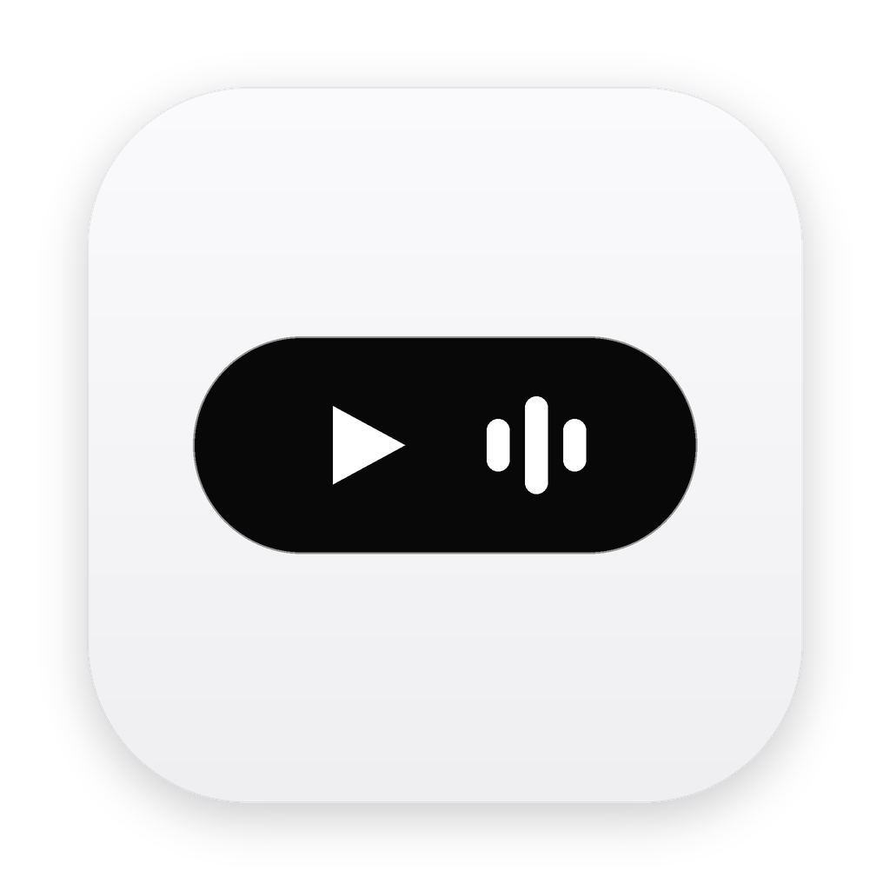
</p>

<h1 align="center">FaceIsland (dynamicMac)</h1>

<p align="center">
  <b>macOS için Gelişmiş Dinamik Ada, Yüz Tanıma (Face ID) ile Kilit Açma ve Akıllı Kontrol Merkezi</b>
</p>

<p align="center">
  
  
  
  
</p>

---

## Ekran Görüntüleri ve Modüller (Screenshots)

<p align="center">
  <b>Spotify / Apple Music Canlı Medya Çalar ve Dinamik Renk Teması</b><br><br>
  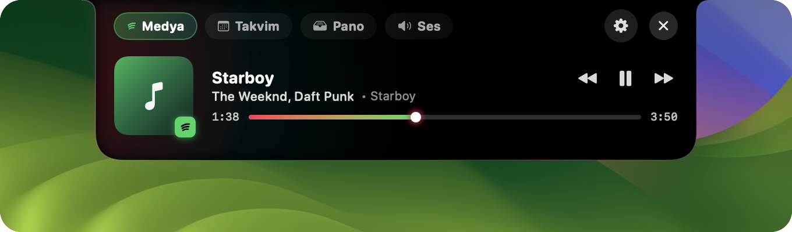
</p>

<p align="center">
  <b>Çentik İçi Canlı Video Oynatıcı (YouTube / Web PiP Video Stream)</b><br><br>
  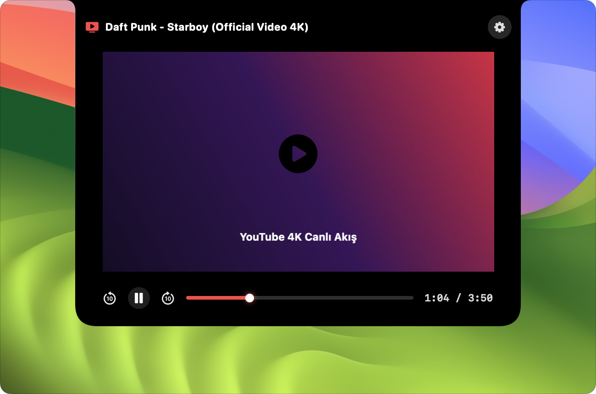
</p>

<p align="center">
  <b>Uygulama Başına Renkli Bağımsız Ses Kontrolü ve Ekolayzır</b><br><br>
  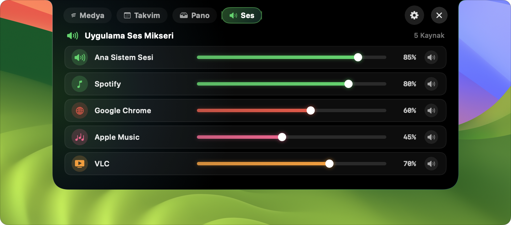
</p>

<p align="center">
  <b>Pano Geçmişi (Clipboard Manager) ve Filtreleme</b><br><br>
  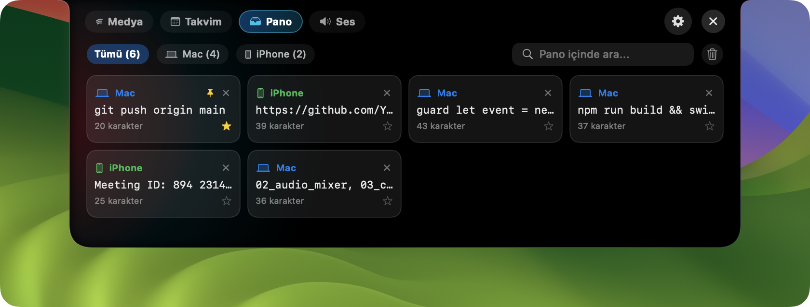
</p>

<p align="center">
  <b>Haftalık İnteraktif Takvim ve Etkinlik Geri Sayımı</b><br><br>
  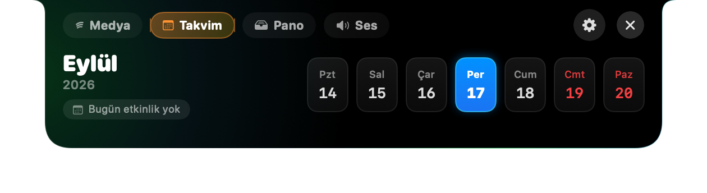
</p>

<p align="center">
  <b>Yerel Apple Vision Face ID Tanıma ve Biyometrik Kilit Açma</b><br><br>
  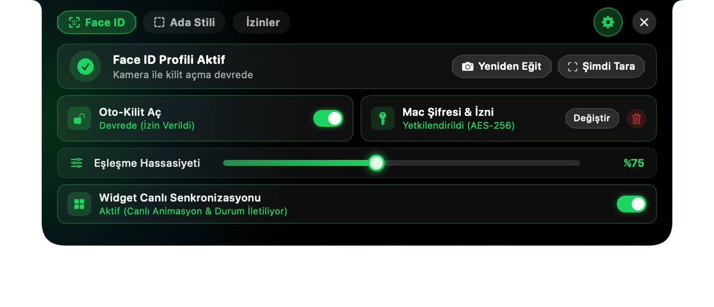
</p>

<p align="center">
  <b>Çentik / Yüzen Kapsül Modu Seçimi ve Canlı Çentik Video Denetimi</b><br><br>
  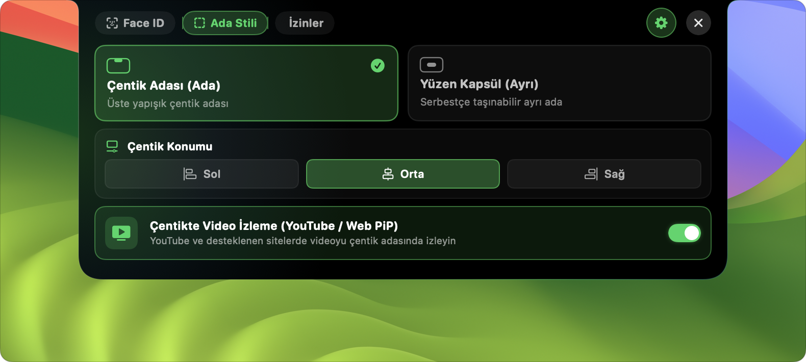
</p>

<p align="center">
  <b>Sistem İzinleri ve Tek Tıkla Yapılandırma</b><br><br>
  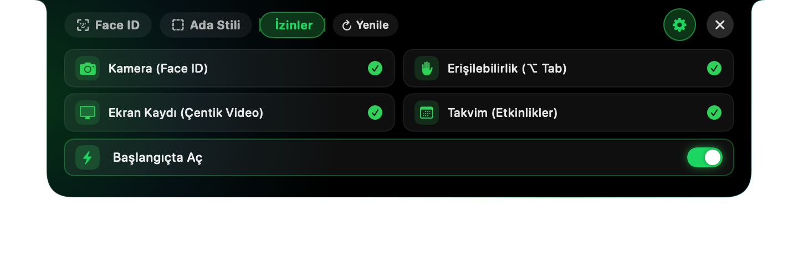
</p>

<p align="center">
  <b>Yüzen Kapsül (Floating Capsule) Serbest Ada Modu</b><br><br>
  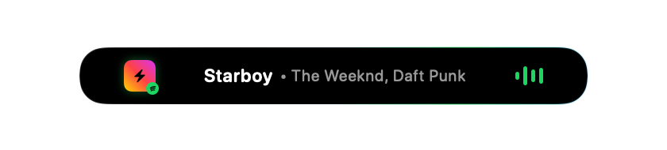
</p>

<p align="center">
  <b>Kompakt Çentik Bildirim Durumu</b><br><br>
  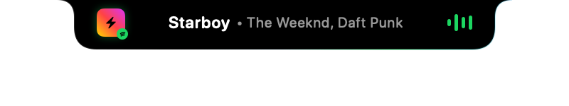
</p>

---

## 🌟 Öne Çıkan Özellikler

### 🏝️ 1. Dinamik Ada & Çentik Entegrasyonu (Dynamic Island)
- **Çentik & Kapsül Modu:** Çentikli MacBook ekranlarında ekran çerçevesine pürüzsüz bağlanan çentik formu veya harici monitörler/çentiksiz Mac'ler için serbest yüzen hap kapsül (Floating Capsule).
- **Piksel Hassasiyetinde Fare Geçirgenliği (Click-Through):** Ada arka plandayken çentik arkasındaki tarayıcı sekmelerine veya butonlara tıklanmasını engellemez.
- **Canlı Ekolayzır & Dinamik Renk Temaları:** Çalınan içeriğe göre (Spotify Yeşil, YouTube Kırmızı, Apple Music Pembe) gerçek zamanlı renk adaptasyonu ve ekolayzır animasyonları.

### 👤 2. Yerel Face ID ile Otomatik Ekran Kilidi Açma
- **Yerel Apple Vision Entegrasyonu:** Ekran uyandığında web kamerasını anlık devreye sokarak yüz biyometrisini karşılaştırır ve ekran kilidini otomatik açar.
- **Sıfır Bulut Bağımlılığı & Gizlilik:** Tüm yüz embedding verileri cihaz içinde Keychain ve yerel şifrelenmiş depolamada saklanır.

### 🎬 3. Çentik İçi Canlı Video Oynatıcı (PiP Notch Player)
- **YouTube & Web Video Entegrasyonu:** Chrome veya Safari'de oynatılan videoları anlık 16:9 çerçeveyle doğrudan çentiğin içine aktarır.
- **İlerleme Çubuğu & Medya Denetimi:** Çentik üzerinde video süresi, ilerleme çubuğu, duraklat/oynat ve ses kontrolleri.

### 🎛️ 4. Uygulama Başına Ses Karıştırıcısı (Per-App Audio Mixer)
- Arka planda ses çalan tüm uygulamaları (Chrome, Arc, Spotify, Apple Music, VLC vb.) otomatik listeler.
- Her uygulamanın ses seviyesini sistem sesinden bağımsız olarak ayarlama veya tek tıkla susturma (mute).

### 📋 5. Akıllı Pano Yöneticisi (Clipboard History)
- Kopyalanan metinleri, kod parçacıklarını ve bağlantıları otomatik olarak hafızada tutar.
- Akıllı dinamik kart tasarımı ve tek tıkla kopyalama desteği.

### 📅 6. Akıllı Takvim & Etkinlik Geri Sayımı
- macOS Takvim ile senkronize olarak yaklaşan toplantı ve etkinlikleri anlık geri sayım sayacıyla adada gösterir.

### 🪟 7. Gelişmiş Alt+Tab Pencere Yöneticisi
- Açık uygulamalar ve pencereler arasında anlık küçük önizlemelerle hızlı geçiş sağlar.

---

## 📦 Kurulum (Installation)

### Yöntem 1: DMG ile Kolay Kurulum (Önerilen)
1. Proje dizinindeki [FaceIsland.dmg](FaceIsland.dmg) dosyasını çift tıklayarak açın.
2. `FaceIsland.app` simgesini `Applications` klasörüne sürükleyip bırakın.
3. Uygulamayı başlatın.

### Yöntem 2: Terminalden Derleme (Swift Package Manager)
```bash
# Depoyu klonlayın
git clone https://github.com/yusufesan/dynamicMac.git
cd dynamicMac

# Debug modunda derleyip çalıştırma
swift run FaceIsland

# Release sürümü derleme
swift build -c release
```

---

## ⚙️ Gerekli İzinler ve Sistem Ayarları

Uygulamanın tüm özelliklerinin eksiksiz çalışabilmesi için aşağıdaki izinlerin verilmesi gerekmektedir:

| İzin Adı | Kullanım Amacı | Nasıl Etkinleştirilir? |
| :--- | :--- | :--- |
| **🌐 Google Chrome Apple Events** | Canlı YouTube/video aktarımı ve ses denetimi | Chrome > Görünüm > Geliştirici > *Apple Etkinliklerinden JavaScript'e İzin Ver* |
| **📷 Kamera (Camera)** | Face ID yüz tanıma ve kilit açma | Sistem Ayarları > Gizlilik ve Güvenlik > Kamera > *FaceIsland* |
| **⌨️ Erişilebilirlik (Accessibility)** | Alt+Tab pencere geçişleri ve fare tıklama geçirgenliği | Sistem Ayarları > Gizlilik ve Güvenlik > Erişilebilirlik > *FaceIsland* |
| **🖥️ Ekran Kaydı (Screen Recording)** | Alt+Tab pencere önizleme küçük resimleri | Sistem Ayarları > Gizlilik ve Güvenlik > Ekran Kaydı > *FaceIsland* |
| **🤖 Otomasyon (Automation)** | Medya oynatıcı kontrolü | Sistem Ayarları > Gizlilik ve Güvenlik > Otomasyon > *FaceIsland* |
| **📅 Takvim (Calendar)** | Yaklaşan etkinlik geri sayımı | Sistem Ayarları > Gizlilik ve Güvenlik > Takvimler > *FaceIsland* |

---

## 🛠️ Teknoloji Yığını

- **Dil / Platform:** Swift 6, macOS 14.0+ (Sonoma & Sequoia)
- **Kullanıcı Arayüzü:** SwiftUI & AppKit Hybrid Canvas
- **Biyometri & Görsel İşleme:** Apple Vision Framework, CoreGraphics, AVFoundation
- **Pencere & Katman Yönetimi:** CoreGraphics, NSPanel (`canJoinAllSpaces`, `fullScreenAuxiliary`)
- **Sistem & Medya Otomasyonu:** AppleScript / NSAppleScript, CoreAudio, ScriptingBridge

